# Grupo
| Número | Nome             |
| ------ | ------- |
| 100749 | José Luís Costa |
| 100838 | Jorge Teixeira |
| 100758 | Hugo Dias |

# Sistema de Recursos Educativos

## Índice
1. [Introdução](#introdução)
2. [Requisitos](#requisitos)
   - [Funcionalidades Implementadas](#funcionalidades-implementadas)
   - [Disponibilização de Recursos Diversificados](#disponibilização-de-recursos-diversificados)
   - [Adição de Novos Recursos e Tipos de Recursos](#adição-de-novos-recursos-e-tipos-de-recursos)
   - [Sistema de Postagem e Comentários](#sistema-de-postagem-e-comentários)
   - [Sistema de Ranking e Avaliação](#sistema-de-ranking-e-avaliação)
   - [Perfil de Utilizador](#perfil-de-utilizador)
   - [Funcionalidades Administrativas](#funcionalidades-administrativas)
   - [Upload e Download de Arquivos](#upload-e-download-de-arquivos)
3. [Arquitetura da Solução](#arquitetura-da-solução)
4. [Tecnologias Utilizadas](#tecnologias-utilizadas)
5. [Detalhes das Rotas](#detalhes-das-rotas)
   - [Rotas de Recursos](#rotas-de-recursos)
   - [Rotas de Posts](#rotas-de-posts)
   - [Rotas de Comentários e Respostas](#rotas-de-comentários-e-respostas)
   - [Rotas de Votação](#rotas-de-votação)
   - [Rotas de Perfil](#rotas-de-perfil)
   - [Rotas de Rankings](#rotas-de-rankings)
   - [Rotas de Autenticação](#rotas-de-autenticação)
   - [Rotas de Upload e Download](#rotas-de-upload-e-download)
   - [Rotas de Administração](#rotas-de-administração)
6. [Conclusão](#conclusão)

## Introdução

Este relatório apresenta o desenvolvimento de uma plataforma educativa destinada a disponibilizar diversos tipos de recursos educativos, tais como livros, artigos, aplicações, trabalhos de alunos, monografias e relatórios. O objetivo principal é criar um ambiente colaborativo onde os utilizadores possam compartilhar, avaliar e comentar sobre recursos educativos, promovendo assim a troca de conhecimento e a valorização de conteúdos de qualidade.

## Requisitos

### Funcionalidades Implementadas

A plataforma oferece uma ampla gama de funcionalidades para garantir uma experiência rica e interativa para os utilizadores:

#### Disponibilização de Recursos Diversificados
- Os utilizadores podem acessar uma variedade de recursos educativos, categorizados por tipo, ano e temas específicos.

#### Adição de Novos Recursos e Tipos de Recursos
- A plataforma permite a adição de novos recursos educativos, garantindo uma constante atualização e expansão do conteúdo disponível.

#### Sistema de Postagem e Comentários
- Os utilizadores podem criar posts sobre recursos específicos, proporcionando insights e discussões detalhadas.
- Outros utilizadores podem comentar nos posts, permitindo uma interação dinâmica e troca de opiniões.

#### Sistema de Ranking e Avaliação
- Os recursos podem ser avaliados pelos utilizadores através de um sistema de estrelas, ajudando a destacar os recursos mais valiosos e relevantes.
- Rankings dos recursos e dos utilizadores são gerados com base nas avaliações recebidas, incentivando a contribuição de conteúdo de alta qualidade.

#### Perfil de Utilizador
- Cada utilizador possui um perfil onde são exibidos seus recursos compartilhados, posts criados, e estatísticas como nível de experiência e classificação média dos seus recursos.
- Sistema de níveis baseado na experiência acumulada através da participação ativa na plataforma.

#### Funcionalidades Administrativas
- Administradores têm a capacidade de gerenciar utilizadores, alternando status de administrador e removendo contas quando necessário.
- Sistema de autenticação seguro com registro, login e logout.

#### Upload e Download de Arquivos
- Recursos podem incluir múltiplos arquivos anexados, os quais podem ser baixados individualmente ou em lote, no formato zip.
- Suporte para upload de dados em formato JSON para facilitar a importação em massa de recursos, utilizadores, posts e comunicados.

## Arquitetura da Solução

A arquitetura da solução foi desenhada para ser modular e escalável, garantindo que novas funcionalidades possam ser adicionadas facilmente. A plataforma é construída utilizando uma única aplicação conectada ao MongoDB, com as seguintes camadas principais:

1. **Camada de Apresentação**: Responsável pela interface com o utilizador. Utiliza HTML, CSS e JavaScript para criar uma experiência de usuário intuitiva e responsiva.
2. **Camada de Lógica de Negócio**: Implementada com Node.js e Express.js, esta camada trata a lógica de aplicação, como autenticação, autorização, manipulação de dados e lógica de negócios específica.
3. **Camada de Dados**: Utiliza MongoDB como banco de dados NoSQL para armazenar informações sobre utilizadores, recursos, posts e avaliações de forma eficiente e escalável.

## Tecnologias Utilizadas

A plataforma foi desenvolvida utilizando as seguintes tecnologias:

- **Node.js**: Plataforma de desenvolvimento para construir a camada de servidor da aplicação.
- **Express.js**: Framework para Node.js que facilita a criação de rotas e middleware.
- **MongoDB**: Banco de dados NoSQL utilizado para armazenar os dados da aplicação.
- **Mongoose**: Biblioteca de modelagem de dados para MongoDB em Node.js.
- **Passport.js**: Middleware de autenticação para Node.js, utilizado para autenticação de utilizadores.
- **JWT (JSON Web Tokens)**: Utilizado para autenticação e gerenciamento de sessões.
- **Multer**: Middleware para manipulação de uploads de arquivos.

## Detalhes das Rotas

### Rotas de Recursos

- **GET `/`**: Obtém e exibe todos os posts, recursos e comunicados ordenados por data.
- **GET `/listaRecursos`**: Exibe uma lista de recursos, com opção de pesquisa.
- **GET `/resource/:id`**: Exibe os detalhes de um recurso específico, incluindo o criador e permissões.
- **DELETE `/resource/:id`**: Deleta um recurso específico se o usuário for o autor ou um administrador.
- **GET `/create-post/:resourceId`**: Exibe o formulário de criação de post para um recurso específico.
- **GET `/meusrecursos`**: Exibe os recursos do usuário logado com opção de pesquisa.

### Rotas de Posts

- **GET `/listaPosts`**: Exibe uma lista de posts, incluindo detalhes do usuário, com opção de pesquisa.
- **GET `/post/:id`**: Exibe os detalhes de um post específico, incluindo recursos, autor e comentários.
- **DELETE `/post/:id`**: Deleta um post específico se o usuário for o autor ou um administrador.
- **POST `/create-post/:resourceId`**: Cria um novo post para um recurso específico e atualiza o XP do usuário.
- **GET `/meusposts`**: Exibe os posts do usuário logado com opção de pesquisa.

### Rotas de Comentários e Respostas

- **POST `/post/:id/comment`**: Adiciona um comentário a um post específico e atualiza o XP do usuário.
- **POST `/post/:id/comment/:commentId/reply`**: Adiciona uma resposta a um comentário específico e atualiza o XP do usuário.
- **DELETE `/post/:postId/comment/:commentId`**: Deleta um comentário específico de um post se o usuário for o autor ou um administrador.
- **DELETE `/post/:postId/comment/:commentId/reply/:replyId`**: Deleta uma resposta específica de um comentário se o usuário for o autor ou um administrador.

### Rotas de Votação

- **POST `/post/:id/vote`**: Permite que um usuário vote (upvote ou downvote) em um post específico.
- **POST `/post/:postId/comment/:commentId/vote`**: Permite que um usuário vote (upvote ou downvote) em um comentário específico.
- **POST `/post/:postId/comment/:commentId/reply/:replyId/vote`**: Permite que um usuário vote (upvote ou downvote) em uma resposta específica.

### Rotas de Perfil

- **GET `/perfil`**: Exibe o perfil do usuário logado, incluindo recursos, posts e estatísticas.
- **GET `/perfil/:id`**: Exibe o perfil de um usuário específico, incluindo recursos, posts e estatísticas.

### Rotas de Rankings

- **GET `/rankings`**: Exibe a página principal de rankings.
- **GET `/rankings/recursos`**: Exibe o ranking dos recursos por classificação média.
- **GET `/rankings/level`**: Exibe o ranking dos utilizadores por nível e XP.
- **GET `/rankings/users`**: Exibe o ranking dos utilizadores por classificação média dos recursos.

### Rotas de Autenticação

- **GET `/login`**: Exibe a página de login.
- **POST `/login`**: Autentica um usuário e gera um token JWT para sessões válidas.
- **GET `/register`**: Exibe a página de registro.
- **POST `/register`**: Registra um novo usuário, verificando se todos os campos obrigatórios estão preenchidos.
- **GET `/logout`**: Desconecta o usuário, limpando o token de autenticação.

### Rotas de Upload e Download

- **GET `/download/:fname`**: Baixa um arquivo específico.
- **GET `/download-all/:resourceId`**: Baixa todos os arquivos de um recurso específico como um arquivo zip.
- **POST `/adicionarRecurso`**: Adiciona um novo recurso e atualiza o XP do usuário.
- **GET `/upload-json`**: Exibe o formulário de upload de JSON.
- **POST `/upload-json`**: Faz o upload de um arquivo JSON e insere os dados no banco de dados.
- **GET `/download-jsons`**: Baixa todos os dados de utilizadores, recursos, posts e comunicados como um arquivo zip.

### Rotas de Administração

- **POST `/users/:id/toggle-admin`**: Alterna o status de administrador de um usuário específico.
- **POST `/users/:id/delete`**: Deleta um usuário específico.
- **GET `/users`**: Exibe uma lista de todos os utilizadores.

## Interface

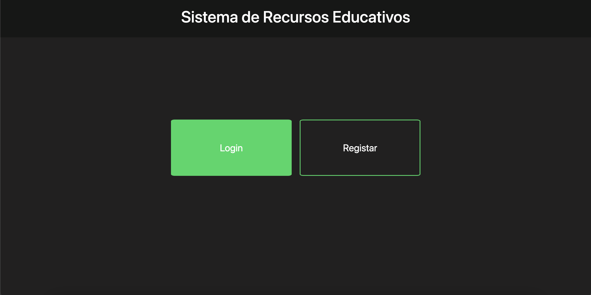
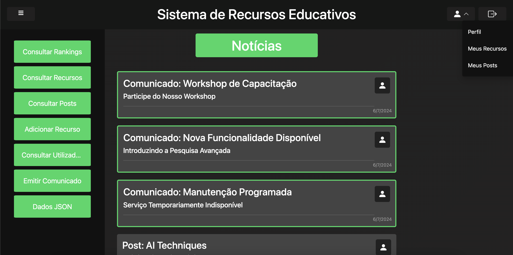
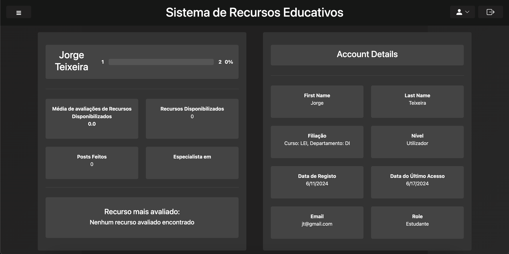
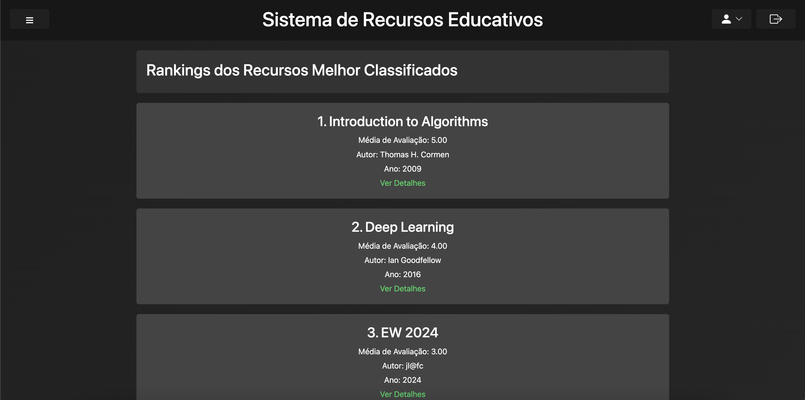
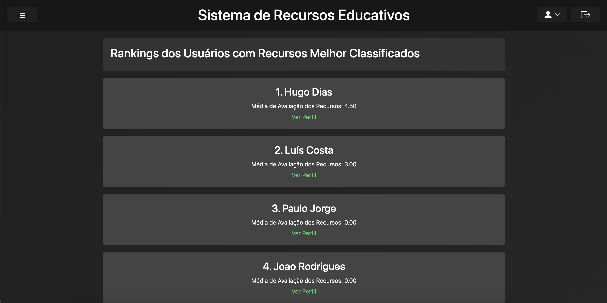
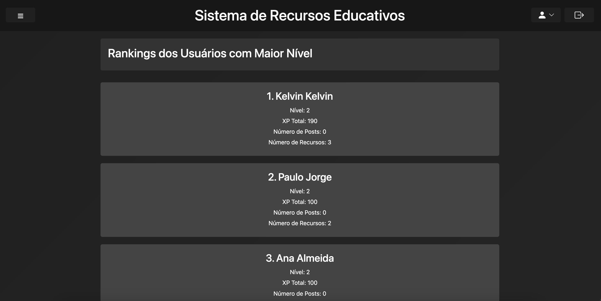
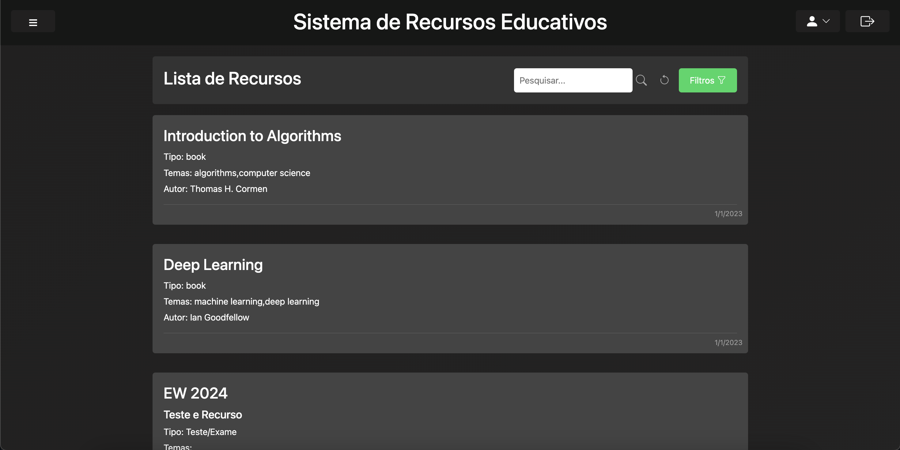
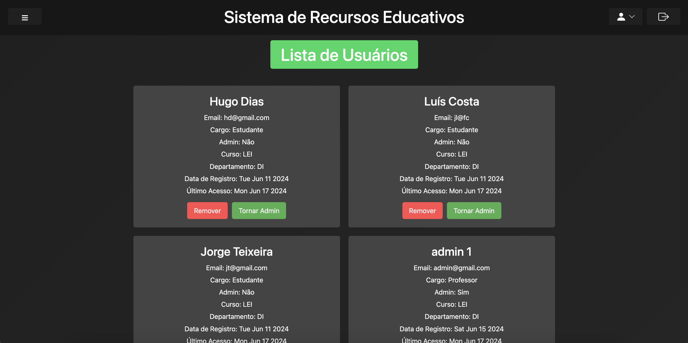
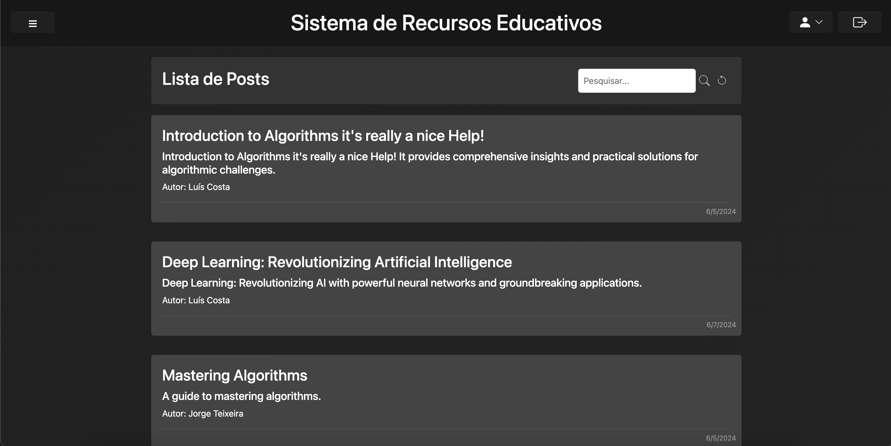
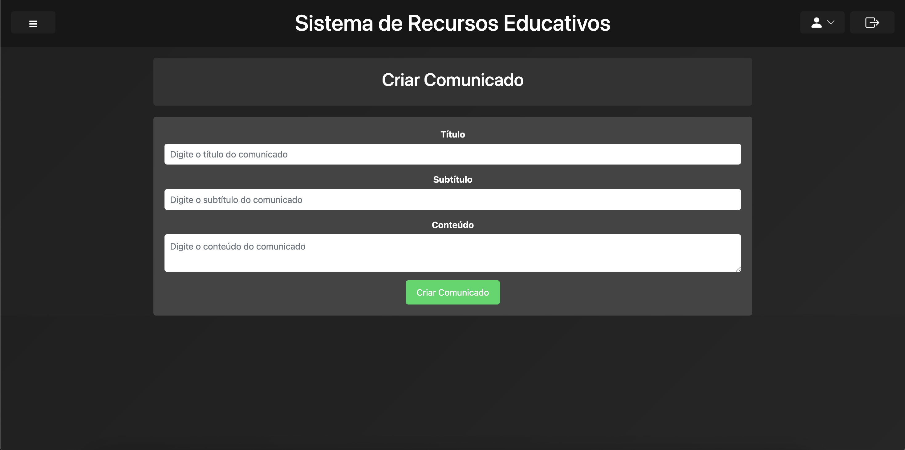
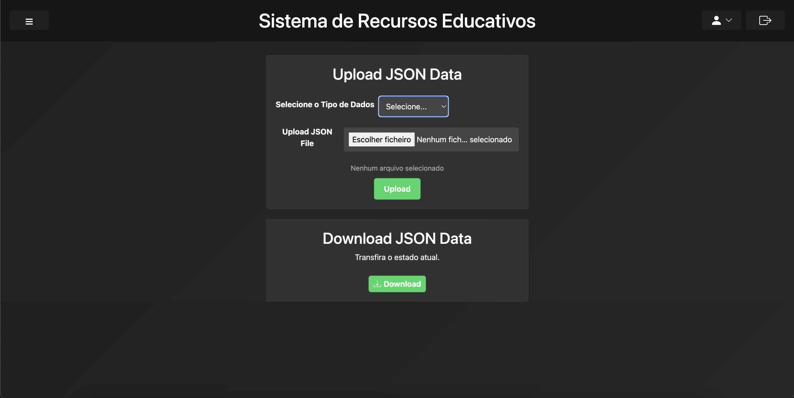
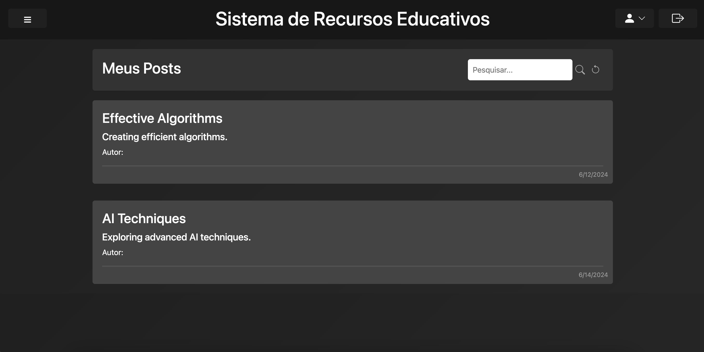

## Conclusão

A plataforma educativa desenvolvida oferece uma solução abrangente e flexível para a disponibilização, compartilhamento e avaliação de recursos educativos. As funcionalidades implementadas visam criar um ambiente colaborativo, incentivando a participação ativa dos utilizadores e a troca de conhecimento.

Para aprimorar a plataforma, várias melhorias podem ser implementadas. Primeiramente, o sistema de upload de recursos pode ser modificado para criar uma pasta específica para cada recurso, permitindo assim que vários ficheiros com o mesmo nome possam ser armazenados sem conflitos. Além disso, seria benéfico adicionar a funcionalidade de comentários às avaliações de recursos, promovendo uma discussão mais detalhada sobre os mesmos. Também é importante permitir que os utilizadores possam editar os seus perfis e posts após a publicação ou mesmo adicionar fotos de perfil de modo a proporcionar uma maior flexibilidade e controlo sobre o conteúdo partilhado pelo próprio utilizador.
